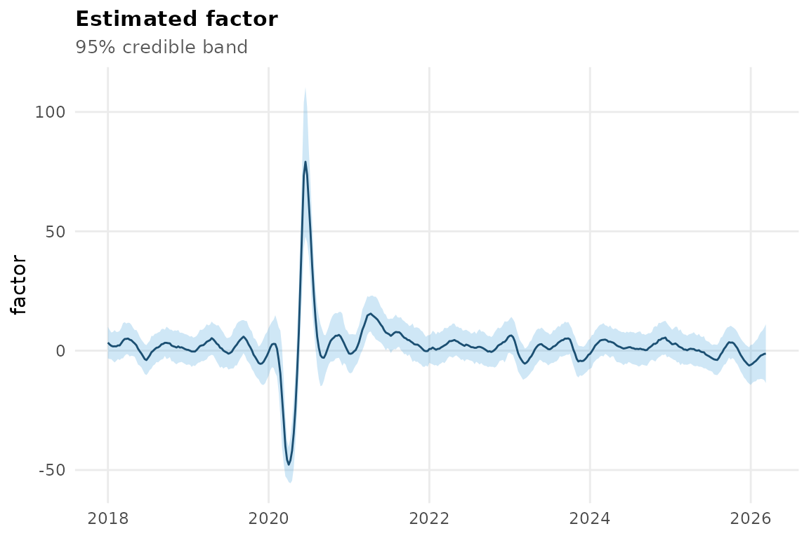
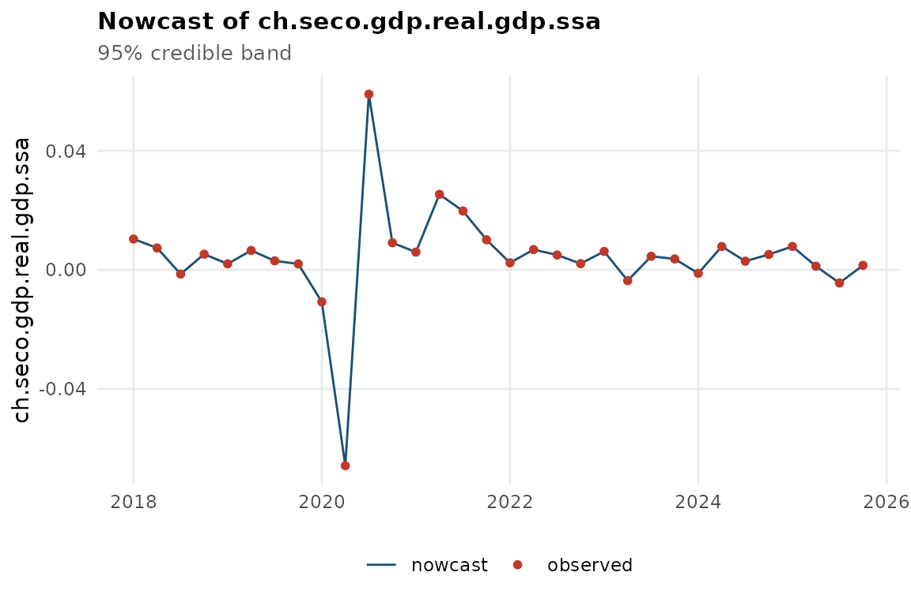
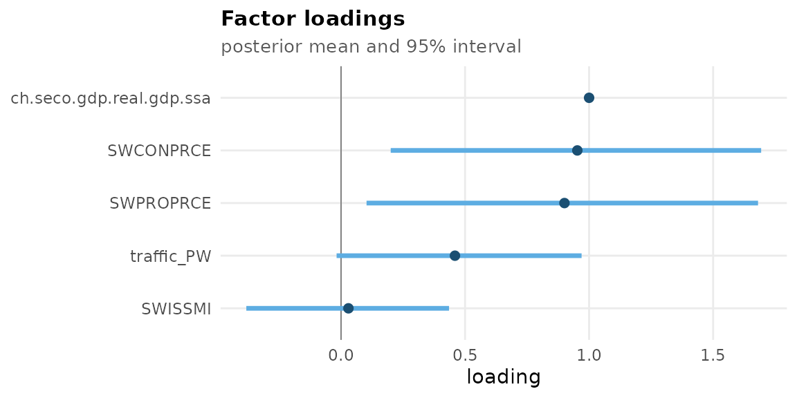
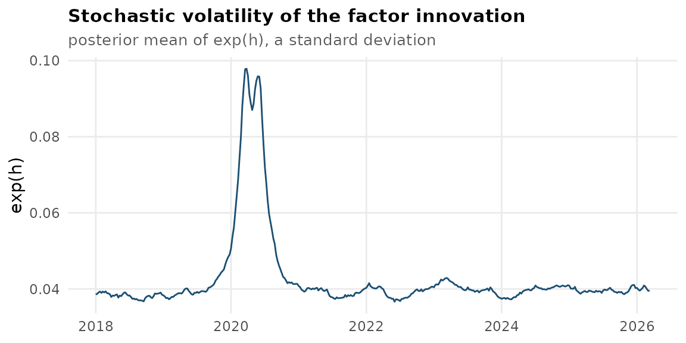
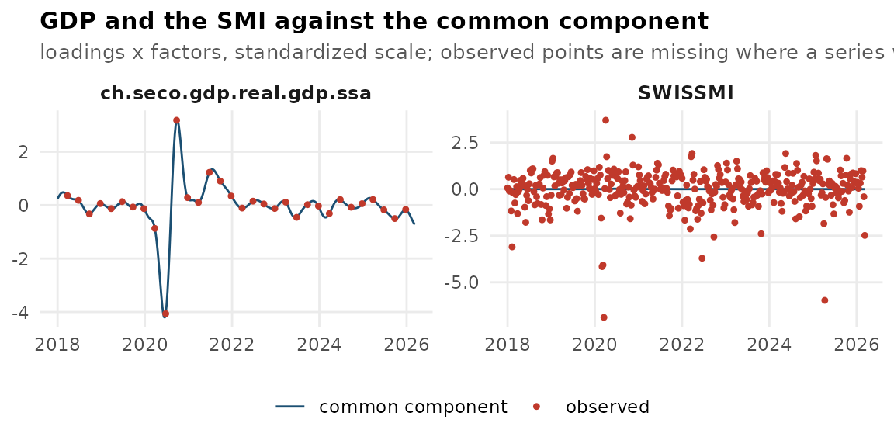
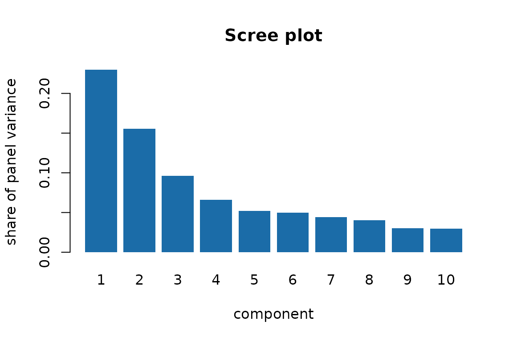

# mfbdfm: A Mixed-Frequency Bayesian Dynamic Factor Model

``` r

library(mfbdfm)
```

## What is mfbdfm?

`mfbdfm` estimates a Bayesian mixed-frequency dynamic factor model: a
single dynamic factor extracted from indicators observed at different
frequencies, optionally anchored to a target series so the factor is
directly interpretable as that series’ growth rate rather than a generic
activity index. The package ships a flagship application, the **Weekly
Activity Index (WAI)**, a high-frequency GDP indicator for Switzerland
anchored to GDP growth, which this vignette uses as the worked example
throughout. WAI is built to combine two kinds of data:

- **Conventional macroeconomic indicators** — surveys, prices, trade,
  purchasing manager indices — published monthly or quarterly, and
- **Alternative high-frequency data** — payment and transaction volumes,
  mobility indicators, search-trend indices, traffic and flight counts —
  available daily or weekly, often with very short histories and
  irregular publication lags.

Unlike unsupervised approaches that extract a factor from high-frequency
data alone (e.g. principal components), the WAI is *supervised*: an
identification restriction anchors the factor to observed GDP growth, so
it is a direct high-frequency proxy for GDP rather than a generic
activity index that merely correlates with it.

The methodology, full empirical results, and a real-time forecast
evaluation are described in Kronenberg (2026); see
[`?mfbdfm`](https://philippkronenberg.github.io/mfbdfm/reference/mfbdfm-package.md)
for the full citation and the underlying multi-factor framework of
Eckert, Kronenberg, Mikosch & Neuwirth (2025). This vignette covers the
package’s user-facing workflow only.

## The model, briefly

[`ind_dfm()`](https://philippkronenberg.github.io/mfbdfm/reference/ind_dfm.md)
estimates a single latent weekly factor $`f_t`$ whose (distributed-lag,
temporally aggregated) measurement equation links it to every input
series, and whose autoregressive state equation includes **stochastic
volatility** so the variance of common shocks can rise during crises
instead of being smoothed away. Three features make this work with
real-world mixed-frequency data:

- **Data augmentation** treats missing and lower-frequency observations
  as latent states, so a series that starts in 2020 and updates weekly,
  another that starts in 1990 and updates monthly, and quarterly GDP
  itself can all enter the same state-space model.
- **Stochastic volatility** in the factor state equation lets abrupt
  swings (e.g. the COVID-19 pandemic) show up as genuinely higher
  volatility rather than being averaged away.
- **Quasi-differencing** of the measurement equation removes serial
  correlation in each series’ idiosyncratic errors, so persistent
  indicator-specific noise doesn’t get misattributed to the common
  factor.

Identification fixes the factor’s loading on the target series (GDP) to
one and shrinks its measurement error toward zero, so the factor tracks
GDP growth closely by construction — see
[`?ind_dfm`](https://philippkronenberg.github.io/mfbdfm/reference/ind_dfm.md)
for the details and references, and
[`vignette("mfbdfm")`](https://philippkronenberg.github.io/mfbdfm/articles/mfbdfm.md)’s
“Real-time GDP vintages” section below for how the target series itself
is constructed for live use.

## A minimal worked example

The package ships a curated, model-ready dataset,
`data_ch_dataset_test`, so a small demonstration model can be estimated
without any external data. Real analyses use the full indicator set and
a much longer chain (the accompanying paper uses `length_sample = 5000`
after a burn-in of 1000); here we use a tiny subset and a short chain
purely so this vignette builds quickly.

``` r

data(data_ch_dataset_test)

target <- "ch.seco.gdp.real.gdp.ssa"
flows <- lapply(
  data_ch_dataset_test$flows[c(target, "SWISSMI", "traffic_PW")],
  stats::window, start = 2018
)
stocks <- lapply(data_ch_dataset_test$stocks[1:2], stats::window, start = 2018)

set.seed(1)
fit <- ind_dfm(
  flows = flows, stocks = stocks, target = target,
  length_sample = 200, burn_in = 50
)
#> preallocating..
#> simulating posterior distribution..
#>   |                                                                              |                                                                      |   0%  |                                                                              |=                                                                     |   1%  |                                                                              |=                                                                     |   2%  |                                                                              |==                                                                    |   2%  |                                                                              |==                                                                    |   3%  |                                                                              |===                                                                   |   4%  |                                                                              |===                                                                   |   5%  |                                                                              |====                                                                  |   5%  |                                                                              |====                                                                  |   6%  |                                                                              |=====                                                                 |   7%  |                                                                              |=====                                                                 |   8%  |                                                                              |======                                                                |   8%  |                                                                              |======                                                                |   9%  |                                                                              |=======                                                               |  10%  |                                                                              |========                                                              |  11%  |                                                                              |========                                                              |  12%  |                                                                              |=========                                                             |  12%  |                                                                              |=========                                                             |  13%  |                                                                              |==========                                                            |  14%  |                                                                              |==========                                                            |  15%  |                                                                              |===========                                                           |  15%  |                                                                              |===========                                                           |  16%  |                                                                              |============                                                          |  17%  |                                                                              |============                                                          |  18%  |                                                                              |=============                                                         |  18%  |                                                                              |=============                                                         |  19%  |                                                                              |==============                                                        |  20%  |                                                                              |===============                                                       |  21%  |                                                                              |===============                                                       |  22%  |                                                                              |================                                                      |  22%  |                                                                              |================                                                      |  23%  |                                                                              |=================                                                     |  24%  |                                                                              |=================                                                     |  25%  |                                                                              |==================                                                    |  25%  |                                                                              |==================                                                    |  26%  |                                                                              |===================                                                   |  27%  |                                                                              |===================                                                   |  28%  |                                                                              |====================                                                  |  28%  |                                                                              |====================                                                  |  29%  |                                                                              |=====================                                                 |  30%  |                                                                              |======================                                                |  31%  |                                                                              |======================                                                |  32%  |                                                                              |=======================                                               |  32%  |                                                                              |=======================                                               |  33%  |                                                                              |========================                                              |  34%  |                                                                              |========================                                              |  35%  |                                                                              |=========================                                             |  35%  |                                                                              |=========================                                             |  36%  |                                                                              |==========================                                            |  37%  |                                                                              |==========================                                            |  38%  |                                                                              |===========================                                           |  38%  |                                                                              |===========================                                           |  39%  |                                                                              |============================                                          |  40%  |                                                                              |=============================                                         |  41%  |                                                                              |=============================                                         |  42%  |                                                                              |==============================                                        |  42%  |                                                                              |==============================                                        |  43%  |                                                                              |===============================                                       |  44%  |                                                                              |===============================                                       |  45%  |                                                                              |================================                                      |  45%  |                                                                              |================================                                      |  46%  |                                                                              |=================================                                     |  47%  |                                                                              |=================================                                     |  48%  |                                                                              |==================================                                    |  48%  |                                                                              |==================================                                    |  49%  |                                                                              |===================================                                   |  50%  |                                                                              |====================================                                  |  51%  |                                                                              |====================================                                  |  52%  |                                                                              |=====================================                                 |  52%  |                                                                              |=====================================                                 |  53%  |                                                                              |======================================                                |  54%  |                                                                              |======================================                                |  55%  |                                                                              |=======================================                               |  55%  |                                                                              |=======================================                               |  56%  |                                                                              |========================================                              |  57%  |                                                                              |========================================                              |  58%  |                                                                              |=========================================                             |  58%  |                                                                              |=========================================                             |  59%  |                                                                              |==========================================                            |  60%  |                                                                              |===========================================                           |  61%  |                                                                              |===========================================                           |  62%  |                                                                              |============================================                          |  62%  |                                                                              |============================================                          |  63%  |                                                                              |=============================================                         |  64%  |                                                                              |=============================================                         |  65%  |                                                                              |==============================================                        |  65%  |                                                                              |==============================================                        |  66%  |                                                                              |===============================================                       |  67%  |                                                                              |===============================================                       |  68%  |                                                                              |================================================                      |  68%  |                                                                              |================================================                      |  69%  |                                                                              |=================================================                     |  70%  |                                                                              |==================================================                    |  71%  |                                                                              |==================================================                    |  72%  |                                                                              |===================================================                   |  72%  |                                                                              |===================================================                   |  73%  |                                                                              |====================================================                  |  74%  |                                                                              |====================================================                  |  75%  |                                                                              |=====================================================                 |  75%  |                                                                              |=====================================================                 |  76%  |                                                                              |======================================================                |  77%  |                                                                              |======================================================                |  78%  |                                                                              |=======================================================               |  78%  |                                                                              |=======================================================               |  79%  |                                                                              |========================================================              |  80%  |                                                                              |=========================================================             |  81%  |                                                                              |=========================================================             |  82%  |                                                                              |==========================================================            |  82%  |                                                                              |==========================================================            |  83%  |                                                                              |===========================================================           |  84%  |                                                                              |===========================================================           |  85%  |                                                                              |============================================================          |  85%  |                                                                              |============================================================          |  86%  |                                                                              |=============================================================         |  87%  |                                                                              |=============================================================         |  88%  |                                                                              |==============================================================        |  88%  |                                                                              |==============================================================        |  89%  |                                                                              |===============================================================       |  90%  |                                                                              |================================================================      |  91%  |                                                                              |================================================================      |  92%  |                                                                              |=================================================================     |  92%  |                                                                              |=================================================================     |  93%  |                                                                              |==================================================================    |  94%  |                                                                              |==================================================================    |  95%  |                                                                              |===================================================================   |  95%  |                                                                              |===================================================================   |  96%  |                                                                              |====================================================================  |  97%  |                                                                              |====================================================================  |  98%  |                                                                              |===================================================================== |  98%  |                                                                              |===================================================================== |  99%  |                                                                              |======================================================================| 100%
#> processing output..

class(fit)
#> [1] "ind_dfm"
names(fit)
#>  [1] "factor"         "factor_var"     "factor_std"     "index"         
#>  [5] "nowcast"        "nowcast_var"    "target"         "pars"          
#>  [9] "pars_dist"      "data"           "data_raw"       "data_augmented"
#> [13] "inventory"      "call"
```

`fit$factor` is the annualized weekly growth rate implied by the model —
the WAI itself — and `fit$nowcast` is that same information aggregated
back up to the target’s own (here quarterly) frequency:

``` r

plot(fit)
```



[`mfbdfm_nowcast()`](https://philippkronenberg.github.io/mfbdfm/reference/mfbdfm_nowcast.md)
is the accessor for those nowcasts, returning them with a credible band
rather than as a bare `ts`. It works the same way for a
[`fcast_dfm()`](https://philippkronenberg.github.io/mfbdfm/reference/fcast_dfm.md)
fit, and `last = TRUE` gives just the current period — the usual
real-time query:

``` r

tail(mfbdfm_nowcast(fit))
#>       time      nowcast           sd        lower        upper
#> 27 2024.50  0.002901754 5.017349e-07  0.002900771  0.002902738
#> 28 2024.75  0.005175476 5.484667e-07  0.005174401  0.005176551
#> 29 2025.00  0.007858613 5.397740e-07  0.007857555  0.007859671
#> 30 2025.25  0.001230707 5.222492e-07  0.001229683  0.001231730
#> 31 2025.50 -0.004400680 5.601227e-07 -0.004401778 -0.004399583
#> 32 2025.75  0.001506296 5.107896e-07  0.001505295  0.001507297
mfbdfm_nowcast(fit, last = TRUE)
#>      time     nowcast           sd       lower       upper
#> 1 2025.75 0.001506296 5.107896e-07 0.001505295 0.001507297
```

There is deliberately no
[`predict()`](https://rdrr.io/r/stats/predict.html) method. The nowcasts
are computed while the model is fitted, so there is no separate
prediction step to run on new data, and a
[`predict()`](https://rdrr.io/r/stats/predict.html) returning stored
values would advertise a capability the model does not have.

`fit$index` gives the cumulated activity level (rebased to 100 at the
start of the estimation window), and `fit$pars` holds the posterior
means of the model parameters, including the factor loadings
(`fit$pars$lambda`) — the target series’ loading is fixed at 1 by
construction:

``` r

fit$pars$lambda[which(fit$inventory$key == target)]
#> [1] 1
```

### Looking at the fit

[`plot()`](https://rdrr.io/r/graphics/plot.default.html) takes a `type`
argument and returns a **ggplot** object, so any view can be modified
before it is printed. The available views are `"factor"` (the default,
above), `"nowcast"`, `"loadings"`, `"residuals"`, `"volatility"` and
`"fit"`; they are the same for both model entry points.

The nowcast view puts the target’s own observations on top of the
model’s estimate of them:

``` r

plot(fit, type = "nowcast")
```



The loadings view shows how strongly each series is tied to the factor.
The target’s loading is the fixed 1 that identifies the model:

``` r

plot(fit, type = "loadings")
```



The volatility view is the posterior mean of `exp(h)`, the standard
deviation of the factor innovation — this is what lets the model absorb
a crisis instead of smearing it across the whole sample:

``` r

plot(fit, type = "volatility")
```



`"residuals"` and `"fit"` compare each series with its **common
component** – loadings times factors, the part the factor explains – so
they show how much of a series the factor accounts for. They draw one
panel per series and accept a `series` argument to pick a few, which
matters once the dataset is the full several dozen series rather than
the handful used here:

``` r

plot(fit, type = "fit", series = c(target, "SWISSMI")) +
  ggplot2::labs(title = "GDP and the SMI against the common component")
```



## Bringing your own data

Above, the series were passed as two lists split by type, which is what
the models use internally. When the data comes from somewhere else — a
spreadsheet, a database query —
[`mfbdfm_data()`](https://philippkronenberg.github.io/mfbdfm/reference/mfbdfm_data.md)
builds that structure from a long or wide data frame, an `mts`, or a
list of `ts`, and takes the flow/stock classification from a `meta`
table:

``` r

series <- c(data_ch_dataset_test$flows[c(target, "SWISSMI")],
            data_ch_dataset_test$stocks[1:2])
meta <- data.frame(series = names(series),
                   type = rep(c("flow", "stock"), each = 2))

d <- mfbdfm_data(series, meta, target = target)
d
#> <mfbdfm_data>  4 series  (2 flow, 2 stock)
#> target: ch.seco.gdp.real.gdp.ssa
#> 
#>   by frequency:
#>         4   1 flow   0 stock
#>        12   0 flow   2 stock
#>        48   1 flow   0 stock   <- highest; flow/stock has no effect here
#> 
#>   series (first 10):
#>     ch.seco.gdp.real.gdp.ssa     flow   freq    4  n   144
#>     SWISSMI                      flow   freq   48  n  1738
#>     SWCONPRCE                    stock  freq   12  n   434
#>     SWPROPRCE                    stock  freq   12  n   433
#> 
#> Pass to ind_dfm() or fcast_dfm() as the first argument.
```

The reason to prefer this over assembling the two lists by hand is the
printout. Whether a series is a flow or a stock selects its temporal
aggregation weights, so getting it wrong changes the results — and when
the type is expressed by *which argument the series was passed in*,
there is nothing to inspect. Printing the object shows the resolved
classification and the frequencies actually in use *before* committing
to a run that can take minutes to hours. It is then passed as the first
argument:

``` r

fit2 <- ind_dfm(d, length_sample = 200, burn_in = 50)
```

`flows`/`stocks` continue to work exactly as before; this is an
additional entry point, not a replacement.

## Choosing the number of factors

[`ind_dfm()`](https://philippkronenberg.github.io/mfbdfm/reference/ind_dfm.md)
has exactly one factor by construction.
[`fcast_dfm()`](https://philippkronenberg.github.io/mfbdfm/reference/fcast_dfm.md)
asks for `q`, and the model gives no guidance on it.
[`select_factors()`](https://philippkronenberg.github.io/mfbdfm/reference/select_factors.md)
computes the Bai & Ng (2002) information criteria IC1, IC2 and IC3, plus
the principal-component eigenvalues behind them:

``` r

sel <- select_factors(flows = data_ch_dataset_test$flows,
                      stocks = data_ch_dataset_test$stocks,
                      max_q = 8, na_action = "interpolate")
#> Warning: IC1/IC2/IC3 are minimised at `max_q` (8), so the minimum may lie
#> beyond the range evaluated. Raise `max_q`; if the minimum stays on the
#> boundary, the panel is too narrow for these criteria to settle - see
#> `?select_factors`.
sel
#> Bai-Ng factor-count selection
#> 
#> Panel: 27 series at frequency 48, 1742 periods
#>        19 lower-frequency series excluded: ch.fso.rtt.ind.r.noga0801.sa, ch.seco.gdp.real.gdp.ssa, ch.ozd.e.wa.index.re.d11, ch.ozd.i.wa.index.re.d11, ...
#>        missing values: interpolate
#> 
#>  q       IC1       IC2       IC3 var % cum %
#>  1 -0.1380   -0.1375   -0.1393    23.0  23.0
#>  2 -0.2397   -0.2386   -0.2424    15.5  38.5
#>  3 -0.2863   -0.2845   -0.2902     9.6  48.1
#>  4 -0.2988   -0.2965   -0.3040     6.6  54.7
#>  5 -0.2976   -0.2947   -0.3041     5.2  59.9
#>  6 -0.3063   -0.3028   -0.3142     5.0  64.9
#>  7 -0.3167   -0.3127   -0.3259     4.4  69.3
#>  8 -0.3332 * -0.3286 * -0.3437 *   4.0  73.3
#> 
#> Chosen q:  IC1 = 8,  IC2 = 8,  IC3 = 8
#> IC1/IC2/IC3 are minimised at max_q = 8, so the minimum may lie beyond
#> the range evaluated. Raise `max_q`.
#> These are frequentist, principal-component criteria. They inform fcast_dfm()'s
#> `q`; they do not determine it.
```

Two things in that printout matter more than the numbers.

The first is **which data the criteria saw**. They are defined for a
balanced panel of a single frequency, so the mixed-frequency input has
to be reduced to one: only the highest-frequency block is kept, and the
quarterly and monthly series — including GDP — are dropped. The model is
then fitted on data the criteria never looked at.

The second is that here **all three criteria are minimised at `max_q`**,
which is why the call warns. That is not a recommendation to use eight
factors; it means the minimum lies outside the range evaluated, or
nowhere. Raising `max_q` does not fix it on this dataset: the penalties
are calibrated for a large cross-section, and with 27 weekly series the
fall in `log V(k)` outruns them. When that happens, read the variance
shares instead:

``` r

round(sel$cum_var_explained[1:6], 3)
#> [1] 0.230 0.385 0.481 0.547 0.599 0.649
screeplot(sel)
```



The first component explains about a quarter of the panel’s variance and
the curve flattens after the third or fourth — which is the sort of
judgement dfms’ vignette reaches for its own data, and the sort of
judgement that has to be made here too.

So: the criteria **inform** `q`, they do not determine it. They are
frequentist and principal-component based, while
[`fcast_dfm()`](https://philippkronenberg.github.io/mfbdfm/reference/fcast_dfm.md)
is Bayesian with post-hoc rotation. Fit two or three values of `q` and
compare; [`screeplot()`](https://rdrr.io/r/stats/screeplot.html) on the
resulting fit shows how much of the panel each *rotated* factor ended up
explaining, which is the corresponding description after the fact.

## Real-time GDP vintages

The full `data_ch_dataset` deliberately ships *without* a GDP target
series: real analyses inject GDP at runtime from the real-time vintage
database, which ships with the package and needs no configuration:

``` r

vintages <- get_real_time_gdp_vintages("quarterly")
dim(vintages)
#> [1] 144 105
```

[`cut_data_real_time()`](https://philippkronenberg.github.io/mfbdfm/reference/cut_data_real_time.md)
truncates a dataset to what would have been observable at a given date,
substituting the appropriate GDP vintage for the target series — the
building block for the paper’s real-time out-of-sample evaluation:

``` r

dat_rt <- cut_data_real_time(data_ch_dataset_test, current_date = 2024.5,
                             GDP_gr_vintages = vintages)
tail(time(dat_rt$flows[[target]]))
#>         Qtr1    Qtr2    Qtr3    Qtr4
#> 2022                         2022.75
#> 2023 2023.00 2023.25 2023.50 2023.75
#> 2024 2024.00
```

## Beyond this vignette

The functions used in the accompanying analysis pipeline are exported
but need either the full (non-shipped) indicator set or previously saved
model fits, so they aren’t run here:

``` r

# Estimate the full WAI and optionally save the fit:
fit_full <- run_wai_adj(
  flows = dat$flows, stocks = dat$stocks, target = target,
  date = 2024.5, dataset_used = "full_RT", output_dir = "fits/updated"
)

# AR(1) benchmark, and the Diebold-Mariano test used to compare them:
fit_ar <- run_ar(flows = dat$flows, stocks = dat$stocks, target = target,
                 date = 2024.5, dataset_used = "full_RT")
dm_test_modified(errors_wai, errors_ar)
```

For the in-sample and out-of-sample evaluation tables and plots shown in
the paper (correlation heatmaps, relative RMSE/MAE tables against the
SECO-WEA, F-CURVE, SECO-SEC, SNB-BCI and KOF-BARO benchmarks), see the
`analysis/5_plots/` scripts in the package’s source repository, which
call
[`get_combined_cor_table()`](https://philippkronenberg.github.io/mfbdfm/reference/get_combined_cor_table.md),
[`get_insample_fit_table()`](https://philippkronenberg.github.io/mfbdfm/reference/get_insample_fit_table.md),
[`create_rel_error_tables()`](https://philippkronenberg.github.io/mfbdfm/reference/create_rel_error_tables.md)
and related functions documented under
[`?get_combined_cor_table`](https://philippkronenberg.github.io/mfbdfm/reference/get_combined_cor_table.md).

## References

### Methodology / WAI background

- Kronenberg, P. (2026) — *A high-frequency GDP indicator for
  Switzerland*, Swiss Journal of Economics and Statistics, 162:10.
  <https://doi.org/10.1186/s41937-026-00157-w>. The primary methodology
  and application paper for this package: derives the WAI as a single,
  GDP-identified factor from the model above, with full in-sample and
  real-time out-of-sample evaluation against the benchmarks listed
  below.
- Eckert, F., Kronenberg, P., Mikosch, H., & Neuwirth, S. (2025) —
  *Tracking economic activity with alternative high-frequency data*,
  Journal of Applied Econometrics, 40(3), 270-290. The underlying
  (multi-factor) Bayesian mixed-frequency dynamic factor model that
  [`ind_dfm()`](https://philippkronenberg.github.io/mfbdfm/reference/ind_dfm.md)
  implements as a single-factor special case.
- Eckert, Kronenberg, Mikosch, Neuwirth — *Weekly Activity Index (WWA)*,
  SECO technical note and press material, 2021. Available from SECO
  (seco.admin.ch).
- SECO — *Die Wöchentliche Wirtschaftsaktivität (WWA)*,
  Diskussionspapier.
- SECO — *Konjunkturtendenzen*, Exkurs on the WWA, issue 2020/4.
- SECO — *BIP-Flash Machbarkeitsstudie*, May 2024.
- SECO — *Einfliessende Indikatoren* (WWA input indicator list).
- SECO — *Methodik* note.

### Model derivation references (cited in Kronenberg 2026, Sect. 2)

- Chan, J. C., & Jeliazkov, I. (2009) — *Efficient simulation and
  integrated likelihood estimation in state space models*, International
  Journal of Mathematical Modelling and Numerical Optimisation, 1(1-2),
  101-120. Precision sampler used for the factor, stochastic volatility,
  and augmented-data Gibbs blocks.
- Chib, S., & Greenberg, E. (1994) — *Bayes inference in regression
  models with ARMA(p,q) errors*, Journal of Econometrics, 64(1-2),
  183-206. Quasi-differencing approach used to remove serial correlation
  in the measurement errors.
- Mariano, R. S., & Murasawa, Y. (2003) — *A new coincident index of
  business cycles based on monthly and quarterly series*, Journal of
  Applied Econometrics, 18(4), 427-443. Geometric-mean temporal
  aggregation scheme for flow variables (the distributed lag matrices
  `L0, ..., Ls`).
- Bai, J., & Wang, P. (2015) — *Identification and Bayesian estimation
  of dynamic factor models*, Journal of Business & Economic Statistics,
  33(2), 221-240. Factor loading normalization used for identification.
- Kim, S., Shepherd, N., & Chib, S. (1998) — *Stochastic volatility:
  Likelihood inference and comparison with ARCH models*, Review of
  Economic Studies, 65(3), 361-393. Mixture-of-normals approximation
  used to linearize the stochastic volatility measurement equation.
- Primiceri, G. E. (2005) — *Time varying structural vector
  autoregressions and monetary policy*, Review of Economic Studies,
  72(3), 821-852.
- Indergand, R., & Leist, S. (2014) — *A Real-Time Data Set for
  Switzerland*, Swiss Journal of Economics and Statistics, 150(4),
  331-352. Source of the real-time GDP vintages read by
  [`get_real_time_gdp_vintages()`](https://philippkronenberg.github.io/mfbdfm/reference/get_real_time_gdp_vintages.md).

### Swiss business-cycle indicator benchmarks

The in-sample and out-of-sample evaluations compare the WAI against
these existing Swiss business-cycle indicators:

- Glocker, C. and Kaniovski, S. (2018) — *Evaluation of Swiss Business
  Cycle Indicators*, WIFO.
- Glocker, C. and Wegmüller, P. (2019) — *30 Indikatoren auf einen
  Schlag*, Die Volkswirtschaft.
- Wegmüller, P. and Glocker, C. (2024) — *Capturing Swiss Economic
  Confidence*.
- Abberger, K. et al. (2014) — *The KOF Economic Barometer*, KOF, ETH
  Zurich.
- Abberger, K. et al. (2018) — *Using rule-based updating procedures to
  improve the performance*.
- Indergand, R. and Leist, S. (2014) — *A Real-Time Data Set for
  Switzerland*.
- Siliverstovs, B. (2011) — *The Real-Time Predictive Content*.

### Official statistics documentation

- FSO — national accounts documentation.
- SNB — Quartalsbulletin 2018/1.
