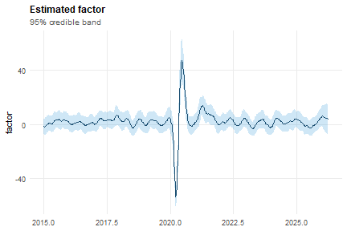
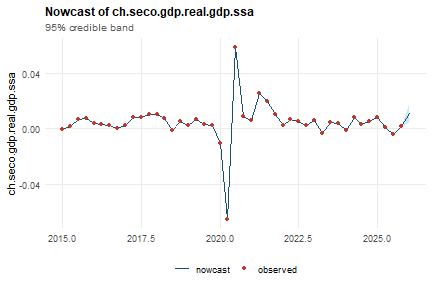
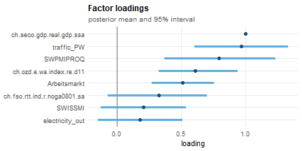
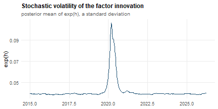
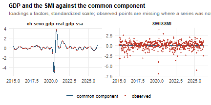
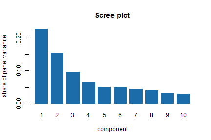

``` r
library(mfbdfm)
```

## Introduction

`mfbdfm` combines indicators observed at different frequencies — weekly,
monthly, quarterly — into a single high-frequency activity factor, and
can anchor that factor to a low-frequency target series so it reads
directly as the target's growth rate. The package ships a flagship
application, the **Weekly Activity Index (WAI)**, a weekly GDP indicator
for Switzerland, which this vignette uses as the worked example
throughout.

This vignette is purely applied: it walks the workflow from data to
nowcast and does not state the model. For the measurement and state
equations, the mixed-frequency aggregation weights, identification and
stochastic volatility, see `vignette("methodology", package = "mfbdfm")`.
The full empirical results and a real-time forecast evaluation are in
Kronenberg (2026); see `?mfbdfm` for the citation and for the underlying
multi-factor framework of Eckert, Kronenberg, Mikosch & Neuwirth (2025).

## Glossary

The package's documentation uses the vocabulary of Bayesian dynamic factor
models throughout. Each term below means exactly this, everywhere in
`mfbdfm`.

**Model structure**

- **Mixed frequency** — input series observed at different sampling
  intervals (here weekly, monthly, quarterly) entering one model without
  first being aggregated to the slowest of them. Internally everything is
  placed on a common 48-periods-per-year weekly grid.
- **Factor** ($f_t$) — the single unobserved (latent) weekly series that
  the model extracts as the common movement shared by all input series. In
  `ind_dfm()` it is reported as an *annualised growth rate*, not as a level.
- **Loading** ($\lambda_i$) — the coefficient linking series $i$ to the
  factor in the measurement equation: how strongly, and with what sign,
  that series responds to a one-unit move in the factor.
- **Measurement equation** — the equation linking each observed series to
  the factor, its distributed lags, and a series-specific *idiosyncratic*
  error. **State equation** — the autoregressive equation governing how the
  factor itself evolves through time.
- **Flow versus stock** — a *flow* variable accumulates within a period
  (GDP, exports), so its low-frequency value aggregates the weekly values
  inside it; a *stock* variable is a snapshot (a survey balance, an index
  level). The classification selects the temporal-aggregation weights, so
  it changes results.
- **Temporal aggregation** — the arithmetic that relates a low-frequency
  observation to the weekly factor values covering the same span; flows use
  the geometric-mean approximation of Mariano and Murasawa (2003).
- **Data augmentation** — treating unobserved values (missing entries,
  and the weekly values of a series that is only published monthly or
  quarterly) as additional unknowns sampled alongside the parameters,
  rather than imputing or discarding them.
- **Quasi-differencing** — transforming the measurement equation by each
  series' own estimated error autocorrelation, so that serially correlated
  idiosyncratic noise is not misread as a movement in the common factor
  (Chib and Greenberg, 1994).
- **Stochastic volatility** — letting the variance of the factor's
  innovations vary over time as its own latent process, so a crisis shows
  up as a genuinely higher variance rather than as a string of implausible
  draws under a constant variance.
- **Identification** — resolving the fact that a factor model cannot
  distinguish $(f_t, \lambda)$ from $(c f_t, \lambda / c)$: the likelihood
  is unchanged, so something must pin the scale (and sign). `ind_dfm()`
  pins it by fixing the loading on the **target** series to one during
  sampling; `fcast_dfm()` leaves the loadings free and resolves the
  indeterminacy after sampling by rotation.
- **Target / anchoring** — the series whose loading is fixed to one in
  `ind_dfm()` (for the WAI, quarterly real GDP). Anchoring is what makes
  the extracted factor interpretable as that series' growth rate at weekly
  frequency, rather than a generic index that merely correlates with it.
  In `fcast_dfm()` the `target` argument does **not** affect estimation; it
  only selects which series' nowcast is surfaced.
- **Common component** — loadings times factors, temporally aggregated:
  the part of a series the factor explains, as opposed to its
  idiosyncratic part.

**Estimation**

- **Prior** — the distribution expressing what is assumed about a
  parameter before seeing the data; **posterior** — the distribution of
  that parameter after conditioning on the data. `dfm_priors()` builds the
  former; every value in a fitted object is a summary of the latter.
- **Hyperparameter** — in this package the term is avoided. The numbers
  passed through `dfm_priors()` are the *parameters of the prior
  distributions* (e.g. the shape and scale of an inverse-gamma prior on a
  variance), and are called prior parameters. Settings that control the
  sampler rather than the model — stability bounds, rotation tolerances —
  are **not** priors and live in `dfm_control()`.
- **Gibbs sampling** — the Markov chain Monte Carlo scheme used here: each
  block of unknowns is drawn in turn from its distribution conditional on
  the current value of all the others, and the chain of such sweeps
  converges on the joint posterior.
- **Draw** — one complete sweep of the sampler, i.e. one sample from the
  posterior. **Burn-in** (`burn_in`) — the initial draws discarded, before
  the chain has reached its stationary distribution. **Thinning**
  (`thinning`) — keeping only every $k$-th retained draw, to reduce the
  autocorrelation between stored draws. `length_sample` is the number of
  draws kept *after* burn-in.
- **Posterior mean / posterior variance** — the average and the variance
  of a quantity across the retained draws. `fit$factor` and `fit$nowcast`
  are posterior means; `fit$factor_var` and `fit$nowcast_var` the matching
  variances.
- **Standardisation** — rescaling every input series, the target
  included, to mean zero and unit variance before estimation, so loadings
  are comparable and no series dominates through its units alone.
  `prepare_data()` does this, and the nowcast is converted back to the
  target's own units afterwards; note that in the prepared matrix a `0`
  encodes *missing*, not the mean.

**Output**

- **Nowcast** — an estimate of the current period's value of a series that
  has not yet been published (quarterly GDP, weeks before its release).
  **Backcast** — the same for a period that is already over but still
  unpublished. **Forecast** — a period that has not yet ended. All three
  come out of the same smoothed state here; they differ only in where the
  estimated period sits relative to the data.
- **Vintage** — the version of a series as it stood at a given past date,
  before subsequent revisions. Real-time evaluation uses the vintage that
  was actually available at each decision date, which is what
  `get_real_time_gdp_vintages()` and `cut_data_real_time()` supply.
- **Index** — the cumulated level path implied by the factor's growth
  rates (`fit$index`), as opposed to the growth rate itself.

## The data

Three datasets ship with the package. `mfbdfm_example_data` is the one
used here: eight series — quarterly GDP plus seven indicators at monthly
and weekly frequency — that already include the GDP target. It is a
ready `mfbdfm_data()` object (see "Bringing your own data" below), so it
carries its own target and its own flow/stock classification, and prints
what it contains:


``` r
data(mfbdfm_example_data)
mfbdfm_example_data
#> <mfbdfm_data>  8 series  (6 flow, 2 stock)
#> target: ch.seco.gdp.real.gdp.ssa
#> 
#>   by frequency:
#>         4   1 flow   0 stock
#>        12   2 flow   1 stock
#>        48   3 flow   1 stock   <- highest; flow/stock has no effect here
#> 
#>   series (first 10):
#>     ch.fso.rtt.ind.r.noga0801.sa flow   freq   12  n   133
#>     ch.ozd.e.wa.index.re.d11     flow   freq   12  n   131
#>     SWPMIPROQ                    stock  freq   12  n   134
#>     SWISSMI                      flow   freq   48  n   538
#>     traffic_PW                   flow   freq   48  n   532
#>     electricity_out              flow   freq   48  n   529
#>     Arbeitsmarkt                 stock  freq   48  n   541
#>     ch.seco.gdp.real.gdp.ssa     flow   freq    4  n    44
#> 
#> Pass to ind_dfm() or fcast_dfm() as the first argument.
```

`data_ch_dataset` is the full curated indicator set and deliberately does
**not** contain GDP — real analyses inject it at runtime from the
real-time vintage database (see "Mixed frequency and real-time vintages"
below). `data_ch_dataset_test` is a variant that includes it.

The flow/stock split matters: whether a series is a *flow* or a *stock*
selects its temporal aggregation weights, so misclassifying a series
changes the results.

## Fitting the model

Real analyses use the full indicator set and a much longer chain — the
accompanying paper uses `length_sample = 5000` after a burn-in of 1000 —
whereas here the eight example series and 2000 retained draws after a
burn-in of 500 are used. This vignette is *precomputed*: the fits below
were run once when it was written, so the output is real rather than
illustrative, and `R CMD check` does not re-run them (see
`vignettes/precompile.R` in the source repository).


``` r
set.seed(1)
fit <- ind_dfm(mfbdfm_example_data, length_sample = 2000, burn_in = 500)
```

Because the object carries `target`, there is no `target =` argument at
the call site:


``` r
target <- mfbdfm_example_data$target
target
#> [1] "ch.seco.gdp.real.gdp.ssa"
```

Printing the fit gives the shape of the model and the most recent
nowcasts:


``` r
fit
#> Single-factor mixed-frequency dynamic factor model (Kronenberg 2026)
#> Call: ind_dfm(flows = mfbdfm_example_data, length_sample = 2000, burn_in = 500)
#> 
#>   series (n) : 8
#>   periods (t): 541
#>   target     : ch.seco.gdp.real.gdp.ssa
#> 
#>   Most recent nowcasts for ch.seco.gdp.real.gdp.ssa:
#> 
#>         time      nowcast
#>     2024.250      0.00785
#>     2024.500      0.00290
#>     2024.750      0.00518
#>     2025.000      0.00786
#>     2025.250      0.00123
#>     2025.500     -0.00440
#>     2025.750      0.00151
#>     2026.000      0.01136
#> 
#> Full results: $factor, $nowcast, $index, $pars; mfbdfm_nowcast(),
#> summary(), plot(), as.data.frame(), coef(), fitted(), residuals(),
#> logLik()
#> Tables: mfbdfm_table_loadings(), mfbdfm_table_parameters(),
#> mfbdfm_table_nowcast()
```

`summary()` adds the posterior loadings and measurement-error variances,
each with a 95% interval, the residual fit on the observed entries, and
a per-series R-squared of the common component. The target's loading is
fixed at 1 by construction — that restriction is what makes the factor a
GDP growth rate rather than a generic index — and its measurement error
is shrunk toward zero, which is also why its own R-squared is close to
one by construction rather than as a finding:


``` r
summary(fit)
#> Single-factor mixed-frequency dynamic factor model (Kronenberg 2026)
#> Call: ind_dfm(flows = mfbdfm_example_data, length_sample = 2000, burn_in = 500)
#> 
#>   series (n) : 8
#>   factors (q): 1
#>   periods (t): 541
#>   target     : ch.seco.gdp.real.gdp.ssa
#> 
#> Factor loadings (posterior mean, 95% interval):
#>                         series   mean     sd   lower  upper
#> 1 ch.fso.rtt.ind.r.noga0801.sa 0.3244 0.1963 -0.0673 0.7037
#> 2     ch.ozd.e.wa.index.re.d11 0.6120 0.1560  0.3256 0.9395
#> 3                      SWISSMI 0.2065 0.1702 -0.1216 0.5389
#> 4                   traffic_PW 0.9686 0.1856  0.6047 1.3338
#> 5              electricity_out 0.1815 0.1677 -0.1481 0.5135
#> 6     ch.seco.gdp.real.gdp.ssa 1.0000 0.0000  1.0000 1.0000
#> 7                    SWPMIPROQ 0.7955 0.2203  0.3715 1.2365
#> 8                 Arbeitsmarkt 0.5126 0.1244  0.2705 0.7544
#> 
#> Measurement error variance (posterior mean, 95% interval):
#>                         series   mean     sd  lower  upper
#> 1 ch.fso.rtt.ind.r.noga0801.sa 0.8751 0.1174 0.6720 1.1330
#> 2     ch.ozd.e.wa.index.re.d11 0.8116 0.1039 0.6219 1.0258
#> 3                      SWISSMI 0.8326 0.0511 0.7412 0.9444
#> 4                   traffic_PW 0.7195 0.0445 0.6364 0.8095
#> 5              electricity_out 0.9736 0.0638 0.8582 1.1036
#> 6     ch.seco.gdp.real.gdp.ssa 0.0010 0.0001 0.0009 0.0011
#> 7                    SWPMIPROQ 0.0855 0.0116 0.0664 0.1117
#> 8                 Arbeitsmarkt 0.3106 0.0196 0.2741 0.3523
#>   (the measurement error sd is the square root of `mean`)
#> 
#> Fit to observed data:
#>   observed values: 2582
#>   residual RMSE  : 6.915e-07 (standardized scale)
#> 
#> R-squared of the common component, by series:
#>   series                                  freq  n_obs R-squared
#>   ch.seco.gdp.real.gdp.ssa                   4     44     1.000
#>   ch.ozd.e.wa.index.re.d11                  12    131     0.137
#>   traffic_PW                                48    532     0.116
#>   Arbeitsmarkt                              48    541     0.065
#>   ch.fso.rtt.ind.r.noga0801.sa              12    133     0.057
#>   SWPMIPROQ                                 12    134     0.052
#>   SWISSMI                                   48    538     0.008
#>   electricity_out                           48    529     0.002
#>   Note: the target's loading is fixed to 1 and its measurement error
#>   shrunk towards zero to identify the factor, so its R-squared is ~1
#>   by construction rather than as a finding.
```

The standard extractors all work. `coef()` returns the loadings,
`as.data.frame()` gives a tidy frame of the factor and its band, and
`fitted()`/`residuals()` return the augmented dataset and its residuals
with missing observations masked. For tables with posterior uncertainty,
ready for a report, see `mfbdfm_table_loadings()`,
`mfbdfm_table_parameters()` and `mfbdfm_table_nowcast()`:


``` r
round(coef(fit), 3)
#> ch.fso.rtt.ind.r.noga0801.sa     ch.ozd.e.wa.index.re.d11 
#>                        0.324                        0.612 
#>                      SWISSMI                   traffic_PW 
#>                        0.206                        0.969 
#>              electricity_out     ch.seco.gdp.real.gdp.ssa 
#>                        0.181                        1.000 
#>                    SWPMIPROQ                 Arbeitsmarkt 
#>                        0.795                        0.513

head(as.data.frame(fit), 3)
#>       time    factor factor_lower factor_upper
#> 1 2015.000 -1.297848    -6.845525     4.249828
#> 2 2015.021 -1.719795    -7.520727     4.081138
#> 3 2015.042 -1.535142    -7.630262     4.559978
```

## Looking at the fit

`plot()` takes a `type` argument and returns a **ggplot** object, so any
view can be modified before it is printed. The available views are
`"factor"` (the default), `"nowcast"`, `"loadings"`, `"residuals"`,
`"volatility"` and `"fit"`; they are the same for both model entry
points. The default is the factor — the WAI itself, an annualized weekly
growth rate — with a 95% posterior credible band:


``` r
plot(fit)
```



The nowcast view puts the target's own observations on top of the
model's estimate of them:


``` r
plot(fit, type = "nowcast")
```



The loadings view shows how strongly each series is tied to the factor,
with a 95% posterior interval. The target's loading is the fixed 1 that
identifies the model:


``` r
plot(fit, type = "loadings")
```



The volatility view is the posterior mean of `exp(h)`, the standard
deviation of the factor innovation — this is what lets the model absorb
a crisis instead of smearing it across the whole sample:


``` r
plot(fit, type = "volatility")
```



`"residuals"` and `"fit"` compare each series with its **common
component** — loadings times factors, the part the factor explains — so
they show how much of a series the factor accounts for. They draw one
panel per series and accept a `series` argument to pick a few, which
matters once the dataset is the full several dozen series rather than the
handful used here:


``` r
plot(fit, type = "fit", series = c(target, "SWISSMI")) +
  ggplot2::labs(title = "GDP and the SMI against the common component")
```



## Nowcasts

`fit$nowcast` is the factor's information at the target's own (here
quarterly) frequency, back in the target's original units.
`mfbdfm_nowcast()` is the accessor for it, returning the nowcasts with a
credible band rather than as a bare `ts`. It works the same way for a
`fcast_dfm()` fit, and `last = TRUE` gives just the current period — the
usual real-time query:


``` r
tail(mfbdfm_nowcast(fit))
#>       time      nowcast           sd        lower        upper
#> 40 2024.75  0.005175413 4.624780e-07  0.005174507  0.005176320
#> 41 2025.00  0.007858623 4.646870e-07  0.007857713  0.007859534
#> 42 2025.25  0.001230718 4.541081e-07  0.001229828  0.001231608
#> 43 2025.50 -0.004400680 4.662971e-07 -0.004401594 -0.004399767
#> 44 2025.75  0.001506242 4.633840e-07  0.001505333  0.001507150
#> 45 2026.00  0.011359580 3.461420e-03  0.004575323  0.018143838
mfbdfm_nowcast(fit, last = TRUE)
#>   time    nowcast         sd       lower      upper
#> 1 2026 0.01135958 0.00346142 0.004575323 0.01814384
```

The band comes from `fit$nowcast_var`, the posterior variance of each
nowcast. Note that it is essentially zero in quarters where the target is
actually observed — the identifying prior shrinks the target's
measurement error toward zero, so the model has nothing to be uncertain
about there. It is informative for the periods the model has to fill in,
which is where a nowcast interval is wanted anyway.

There is deliberately no `predict()` method. The nowcasts are computed
while the model is fitted, so there is no separate prediction step to
run on new data, and a `predict()` returning stored values would
advertise a capability the model does not have.

`fit$index` is the cumulated activity level, rebased to 100 at the start
of the estimation window — the level counterpart of the growth-rate
factor:


``` r
round(tail(fit$index), 2)
#> Time Series:
#> Start = c(2026, 8) 
#> End = c(2026, 13) 
#> Frequency = 48 
#> [1] 122.16 122.27 122.38 122.49 122.58 122.66
```

## Bringing your own data

`mfbdfm_example_data` arrived ready-made. The models themselves take
`flows` and `stocks` as two lists split by type; when the data comes from
somewhere else — a spreadsheet, a database query — `mfbdfm_data()` builds
that structure from a long or wide data frame, an `mts`, or a list of
`ts`, and takes the flow/stock classification from a `meta` table:


``` r
data(data_ch_dataset_test)

series <- c(data_ch_dataset_test$flows[c(target, "SWISSMI", "traffic_PW")],
            data_ch_dataset_test$stocks[1:2])
series <- lapply(series, stats::window, start = 2018)

meta <- data.frame(series = names(series),
                   type = c("flow", "flow", "flow", "stock", "stock"))

d <- mfbdfm_data(series, meta, target = target)
d
#> <mfbdfm_data>  5 series  (3 flow, 2 stock)
#> target: ch.seco.gdp.real.gdp.ssa
#> 
#>   by frequency:
#>         4   1 flow   0 stock
#>        12   0 flow   2 stock
#>        48   2 flow   0 stock   <- highest; flow/stock has no effect here
#> 
#>   series (first 10):
#>     ch.seco.gdp.real.gdp.ssa     flow   freq    4  n    32
#>     SWISSMI                      flow   freq   48  n   394
#>     traffic_PW                   flow   freq   48  n   388
#>     SWCONPRCE                    stock  freq   12  n    98
#>     SWPROPRCE                    stock  freq   12  n    97
#> 
#> Pass to ind_dfm() or fcast_dfm() as the first argument.
```

The reason to prefer this is the printout. When a series' type is
expressed by *which argument it was passed in*, there is nothing to
inspect; printing the object shows the resolved classification and the
frequencies actually in use **before** committing to a run that can take
minutes to hours. The result is passed to `ind_dfm()` exactly as
`mfbdfm_example_data` was above. (`flows`/`stocks` still work as a pair
of lists, if you already have them in that shape; the `mfbdfm_data`
argument is an additional entry point, not a replacement.)

## Mixed frequency and real-time vintages

Nothing above had to be said about frequencies: the example series enter
at 4, 12 and 48 observations per year and the model works on the highest
of them, treating everything unobserved — including the eleven weeks in
which quarterly GDP says nothing — as a latent state. That is the whole
point of the model, and it is why `fit$factor` is weekly even though the
target is quarterly:


``` r
c(factor = frequency(fit$factor), nowcast = frequency(fit$nowcast))
#>  factor nowcast 
#>      48       4
```

The mixed-frequency case that needs more care is a *real-time* one,
where the question is not only which frequency a series has but what was
actually published at a given date. `mfbdfm_example_data` has one GDP
vintage baked in — convenient for an example, but the wrong thing for a
real-time evaluation, which needs the vintage that was current at each
evaluation date. The real-time GDP vintage database ships with the
package and needs no configuration:


``` r
vintages <- get_real_time_gdp_vintages("quarterly")
dim(vintages)
#> [1] 144 105
```

`cut_data_real_time()` truncates a dataset to what would have been
observable at a given date, substituting the appropriate GDP vintage for
the target series — the building block for the paper's real-time
out-of-sample evaluation:


``` r
dat_rt <- cut_data_real_time(data_ch_dataset_test, current_date = 2024.5,
                             GDP_gr_vintages = vintages)
tail(time(dat_rt$flows[[target]]))
#>         Qtr1    Qtr2    Qtr3    Qtr4
#> 2022                         2022.75
#> 2023 2023.00 2023.25 2023.50 2023.75
#> 2024 2024.00
```

## Stochastic volatility and serial correlation

Two model features are switchable, and both default to `TRUE` because
both are wanted on real data.

**Stochastic volatility** lets the variance of the common shocks move
over time, so an abrupt swing such as the COVID-19 pandemic registers as
a genuinely more volatile period instead of being smoothed away. With
`stochastic_volatility = FALSE` a single constant variance is estimated
instead:


``` r
set.seed(1)
fit_const <- ind_dfm(mfbdfm_example_data, length_sample = 2000, burn_in = 500,
                     stochastic_volatility = FALSE)
```

`fit$pars$h` is the posterior mean of the factor's log innovation
standard deviation, so `exp(2 * h)` is the innovation variance. Under
stochastic volatility it varies over the sample; with the option off it
is flat by construction:


``` r
signif(range(exp(2 * fit$pars$h)), 3)
#> [1] 0.00144 0.01120
signif(range(exp(2 * fit_const$pars$h)), 3)
#> [1] 0.0536 0.0536
```

Note that switching it off does **not** fix the variance at a value in
`ind_dfm()` — the loading restriction already pins the factor's scale,
so the variance is the free parameter the data determines and it is
still estimated, just held constant over time. In `fcast_dfm()`, whose
loadings are unrestricted, the same option *does* fix it at one. The
methodology vignette's "Identification" section explains why.

**Serial correlation** in the measurement errors is removed by
quasi-differencing, with one autocorrelation per series drawn from the
data. `fit$pars$rho` reports them; a series with a large `rho` is one
whose own persistent noise would otherwise have been attributed to the
common factor:


``` r
round(stats::setNames(as.numeric(fit$pars$rho), fit$inventory$key), 3)
#> ch.fso.rtt.ind.r.noga0801.sa     ch.ozd.e.wa.index.re.d11 
#>                       -0.061                        0.047 
#>                      SWISSMI                   traffic_PW 
#>                        0.402                        0.429 
#>              electricity_out     ch.seco.gdp.real.gdp.ssa 
#>                       -0.125                        0.000 
#>                    SWPMIPROQ                 Arbeitsmarkt 
#>                        0.954                        0.818
```

`serial_correlation = FALSE` holds all of them at (effectively) zero.

## Choosing the number of factors

`ind_dfm()` has exactly one factor by construction. `fcast_dfm()` asks
for `q`, and the model gives no guidance on it. `select_factors()`
computes the Bai & Ng (2002) information criteria IC1, IC2 and IC3, plus
the principal-component eigenvalues behind them:


``` r
sel <- select_factors(flows = data_ch_dataset_test$flows,
                      stocks = data_ch_dataset_test$stocks,
                      max_q = 8, na_action = "interpolate")
#> Warning: IC1/IC2/IC3 are minimised at `max_q` (8), so the minimum may lie
#> beyond the range evaluated. Raise `max_q`; if the minimum stays on the
#> boundary, the panel is too narrow for these criteria to settle - see
#> `?select_factors`.
sel
#> Bai-Ng factor-count selection
#> 
#> Panel: 27 series at frequency 48, 1742 periods
#>        19 lower-frequency series excluded: ch.fso.rtt.ind.r.noga0801.sa, ch.seco.gdp.real.gdp.ssa, ch.ozd.e.wa.index.re.d11, ch.ozd.i.wa.index.re.d11, ...
#>        missing values: interpolate
#> 
#>  q       IC1       IC2       IC3 var % cum %
#>  1 -0.1380   -0.1375   -0.1393    23.0  23.0
#>  2 -0.2397   -0.2386   -0.2424    15.5  38.5
#>  3 -0.2863   -0.2845   -0.2902     9.6  48.1
#>  4 -0.2988   -0.2965   -0.3040     6.6  54.7
#>  5 -0.2976   -0.2947   -0.3041     5.2  59.9
#>  6 -0.3063   -0.3028   -0.3142     5.0  64.9
#>  7 -0.3167   -0.3127   -0.3259     4.4  69.3
#>  8 -0.3332 * -0.3286 * -0.3437 *   4.0  73.3
#> 
#> Chosen q:  IC1 = 8,  IC2 = 8,  IC3 = 8
#> IC1/IC2/IC3 are minimised at max_q = 8, so the minimum may lie beyond
#> the range evaluated. Raise `max_q`.
#> These are frequentist, principal-component criteria. They inform fcast_dfm()'s
#> `q`; they do not determine it.
```

Two things in that printout matter more than the numbers.

The first is **which data the criteria saw**. They are defined for a
balanced panel of a single frequency, so the mixed-frequency input has to
be reduced to one: only the highest-frequency block is kept, and the
quarterly and monthly series — including GDP — are dropped. The model is
then fitted on data the criteria never looked at.

The second is that here **all three criteria are minimised at `max_q`**,
which is why the call warns. That is not a recommendation to use eight
factors; it means the minimum lies outside the range evaluated, or
nowhere. Raising `max_q` does not fix it on this dataset: the penalties
are calibrated for a large cross-section, and with 27 weekly series the
fall in `log V(k)` outruns them. When that happens, read the variance
shares instead:


``` r
round(sel$cum_var_explained[1:6], 3)
#> [1] 0.230 0.385 0.481 0.547 0.599 0.649
screeplot(sel)
```



The first component explains about a quarter of the panel's variance and
the curve flattens after the third or fourth — which is the sort of
judgement dfms' vignette reaches for its own data, and the sort of
judgement that has to be made here too.

So: the criteria **inform** `q`, they do not determine it. They are
frequentist and principal-component based, while `fcast_dfm()` is
Bayesian with post-hoc rotation. Fit two or three values of `q` and
compare; `screeplot()` on the resulting fit shows how much of the panel
each *rotated* factor ended up explaining, which is the corresponding
description after the fact.

## Beyond this vignette

For several common factors rather than one target-anchored factor, use
`fcast_dfm()`. It implements the multi-factor model of Eckert et al.
(2025) and takes the same data, but identifies the factors by a post-hoc
rotation rather than by anchoring, so its `target` argument only selects
which nowcast is surfaced. `fcast_dfm(q = 1)` is **not** equivalent to
`ind_dfm()`; see `?fcast_dfm` and the methodology vignette.

### The evaluation wrappers

The analysis pipeline does not call `ind_dfm()` directly. It calls
`run_wai_adj()`, which fits the model at one evaluation date, trims the
factor and nowcast to that date, and optionally writes the fit to disk;
and `run_ar()`, which fits the AR(1) benchmark on the target series
alone. Both take the same `flows`/`stocks`/`target` arguments as
`ind_dfm()`, so they run on the example data:


``` r
dat <- mfbdfm_example_data
out_dir <- tempfile()

set.seed(1)
fit_full <- run_wai_adj(
  flows = dat$flows, stocks = dat$stocks, target = target,
  date = 2024.5, dataset_used = "vignette",
  length_sample = 2000, burn_in = 500, output_dir = out_dir
)

fit_ar <- run_ar(flows = dat$flows, stocks = dat$stocks, target = target,
                 date = 2024.5, dataset_used = "vignette")
```


``` r
list.files(out_dir, recursive = TRUE)
#> [1] "vignette/fit_2024.5.Rda"
fit_ar$nowcast
#>             Qtr1
#> 2026 0.004903796
```

The two fits are the ingredients of the paper's out-of-sample
comparison, but they cannot be compared *in* sample, and it is worth
seeing why. Because the factor is anchored to the target, the in-sample
nowcast reproduces observed GDP almost exactly, while the AR(1)
benchmark's one-step errors are of the usual size:


``` r
gdp <- dat$flows[[target]]
errors <- stats::ts.intersect(
  wai = gdp - fit_full$nowcast,
  ar  = stats::residuals(stats::arima(gdp, order = c(1, 0, 0)))
)
colMeans(errors^2)
#>          wai           ar 
#> 1.116141e-16 2.028477e-04
```

A `dm_test_modified()` p-value computed from those two columns would be
arithmetic, not evidence: the left-hand number is an identity, not a
forecast error. The published comparison is therefore *real-time* —
`cut_data_real_time()` inside a loop over vintage dates, refitting at
each one and keeping only the nowcast for the quarter that was not yet
published, as in `analysis/real_time_backcast.R`. `dm_test_modified()`
then takes the two resulting error vectors; see its own help page for a
runnable minimal call.


For the in-sample and out-of-sample evaluation tables and plots shown in
the paper (correlation heatmaps, relative RMSE/MAE tables against the
SECO-WEA, F-CURVE, SECO-SEC, SNB-BCI and KOF-BARO benchmarks), see the
`analysis/5_plots/` scripts in the package's source repository, which
call `get_combined_cor_table()`, `get_insample_fit_table()`,
`create_rel_error_tables()` and related functions documented under
`?get_combined_cor_table`.

## Conclusion

The workflow is short: describe the series with `mfbdfm_data()`, fit
with `ind_dfm()` (or `fcast_dfm()`), and read the results off the fit
with `summary()`, `plot()` and the standard extractors. What the package
adds over a generic factor model is the mixed-frequency handling, which
needs no imputation step from you, and the target anchoring, which makes
the extracted factor a growth rate you can quote rather than an index
you have to rescale.

Two things to carry into a real run: use a chain far longer than the one
above (the paper's is `length_sample = 5000`, `burn_in = 1000`, and takes
minutes to hours), and check `mfbdfm_data()`'s printed flow/stock split
before starting it.

For the model itself, see
`vignette("methodology", package = "mfbdfm")`.

## References

### Methodology / WAI background

- Kronenberg, P. (2026) — *A high-frequency GDP indicator for
  Switzerland*, Swiss Journal of Economics and Statistics, 162:10.
  <https://doi.org/10.1186/s41937-026-00157-w>. The primary methodology
  and application paper for this package: derives the WAI as a single,
  GDP-identified factor, with full in-sample and real-time
  out-of-sample evaluation against the benchmarks listed below.
- Eckert, F., Kronenberg, P., Mikosch, H., & Neuwirth, S. (2025) —
  *Tracking economic activity with alternative high-frequency data*,
  Journal of Applied Econometrics, 40(3), 270-290.
  <https://doi.org/10.1002/jae.3104>. The multi-factor Bayesian
  mixed-frequency dynamic factor model implemented by `fcast_dfm()`.
- Eckert, Kronenberg, Mikosch, Neuwirth — *Weekly Activity Index (WWA)*,
  SECO technical note and press material, 2021. Available from SECO
  (seco.admin.ch).
- SECO — *Die Wöchentliche Wirtschaftsaktivität (WWA)*, Diskussionspapier.
- SECO — *Konjunkturtendenzen*, Exkurs on the WWA, issue 2020/4.
- SECO — *BIP-Flash Machbarkeitsstudie*, May 2024.
- SECO — *Einfliessende Indikatoren* (WWA input indicator list).
- SECO — *Methodik* note.

The references for the model's derivation — Chan & Jeliazkov (2009),
Chib & Greenberg (1994), Mariano & Murasawa (2003), Bai & Wang (2015),
Kim, Shephard & Chib (1998), Primiceri (2005), Indergand & Leist (2014)
— are listed in `vignette("methodology", package = "mfbdfm")`.
Bai & Ng (2002), used by `select_factors()`, is cited in
`?select_factors`.

### Swiss business-cycle indicator benchmarks

The in-sample and out-of-sample evaluations compare the WAI against
these existing Swiss business-cycle indicators:

- Glocker, C. and Kaniovski, S. (2018) — *Evaluation of Swiss Business
  Cycle Indicators*, WIFO.
- Glocker, C. and Wegmüller, P. (2019) — *30 Indikatoren auf einen
  Schlag*, Die Volkswirtschaft.
- Wegmüller, P. and Glocker, C. (2024) — *Capturing Swiss Economic
  Confidence*.
- Abberger, K. et al. (2014) — *The KOF Economic Barometer*, KOF, ETH
  Zurich.
- Abberger, K. et al. (2018) — *Using rule-based updating procedures to
  improve the performance*.
- Indergand, R. and Leist, S. (2014) — *A Real-Time Data Set for
  Switzerland*.
- Siliverstovs, B. (2011) — *The Real-Time Predictive Content*.

### Official statistics documentation

- FSO — national accounts documentation.
- SNB — Quartalsbulletin 2018/1.
